# Pinterest Clone - UAS Aplikasi Mobile 2

### Identitas Mahasiswa
* [cite_start]**Nama**: Ahmad Ridha [cite: 32]
* [cite_start]**NIM**: 2304411647 [cite: 32]
* [cite_start]**Kelas**: (5K RPL GAB 3) [cite: 32]

* ### Deskripsi Proyek
* [cite_start]**Tema**: Pinterest Clone [cite: 33]
* [cite_start]**Aplikasi Rujukan**: [Pinterest Play Store](https://play.google.com/store/apps/details?id=com.pinterest) [cite: 33]

* ### Checklist Fitur 
- [x] [cite_start]Firebase Auth (Email & Password) [cite: 16, 17]
- [x] [cite_start]CRUD Realtime Database [cite: 19, 20]
- [x] [cite_start]Implementasi Fragment & Intent [cite: 21, 22]
- [x] [cite_start]Notifikasi Sistem (Heads-up) [cite: 24]

### Bukti Screenshot Aplikasi
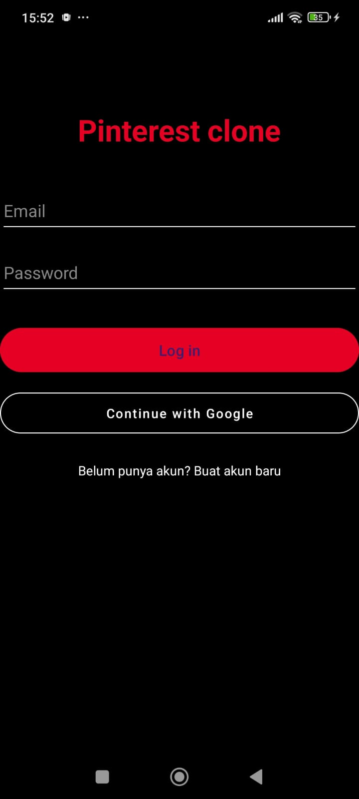
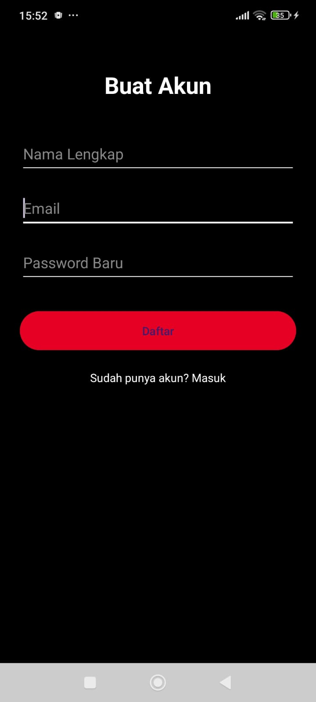
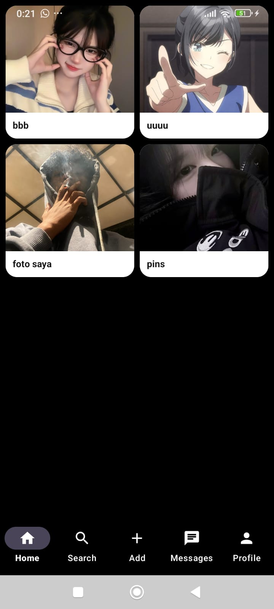
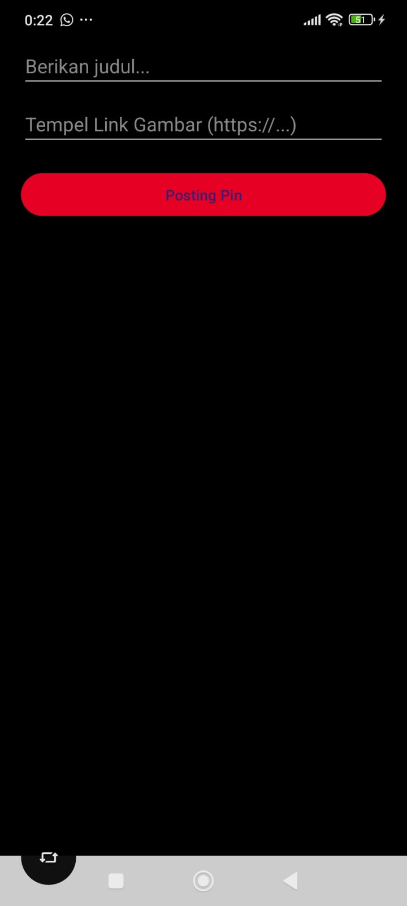
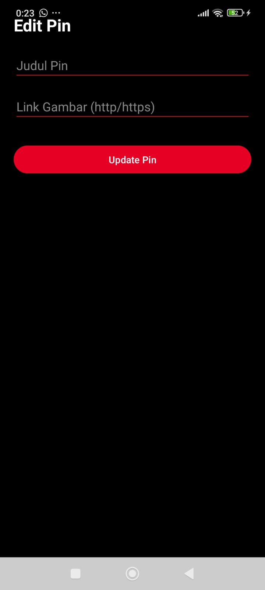
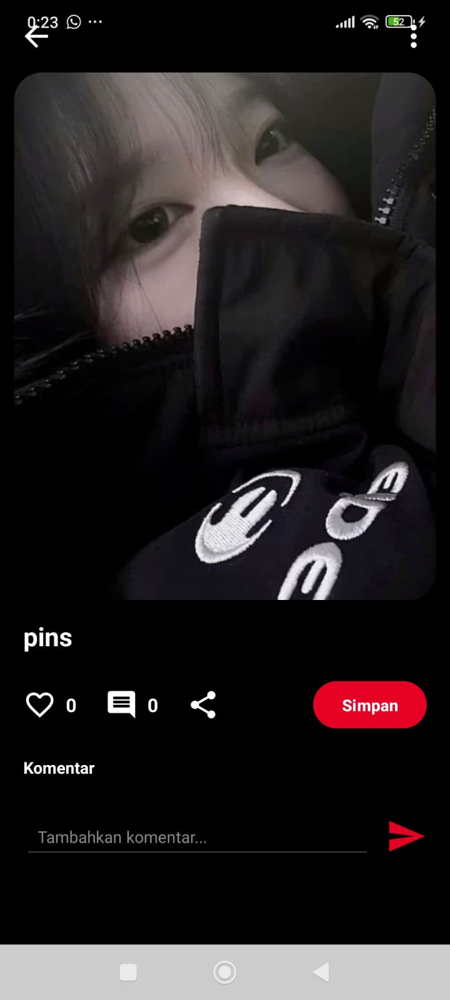
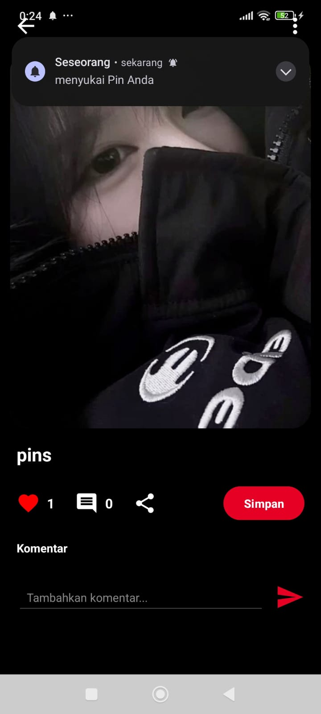

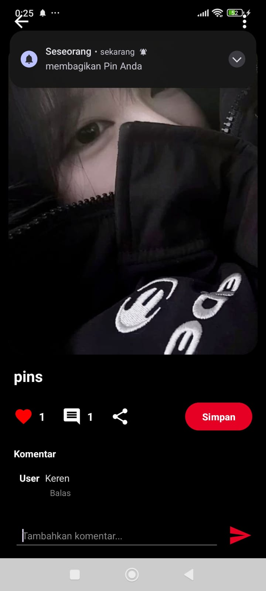
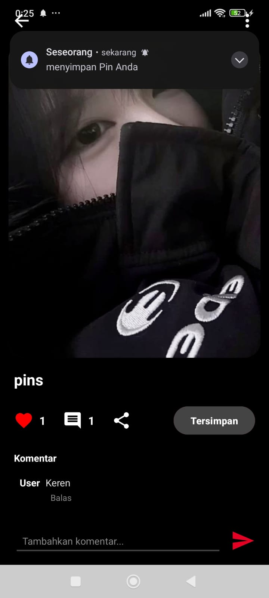
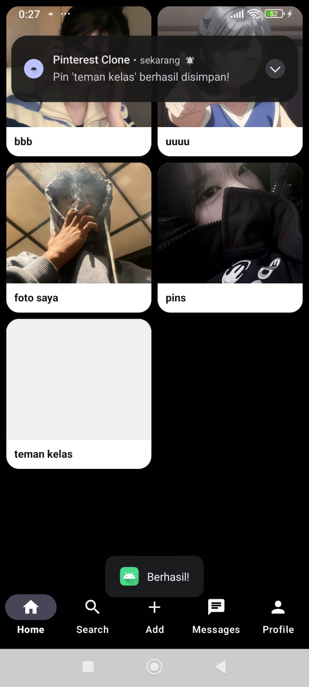
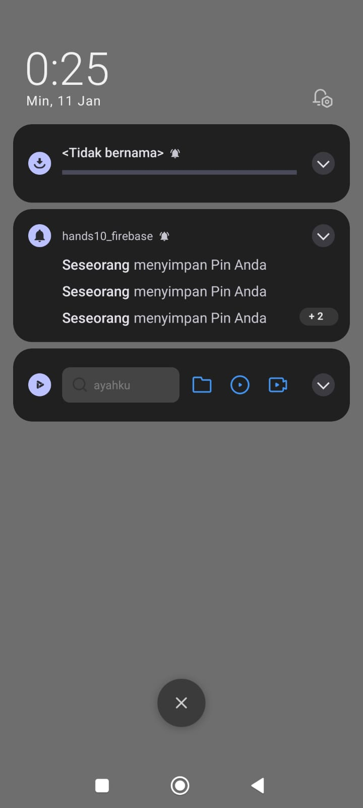
